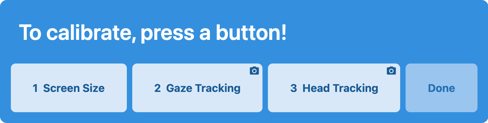
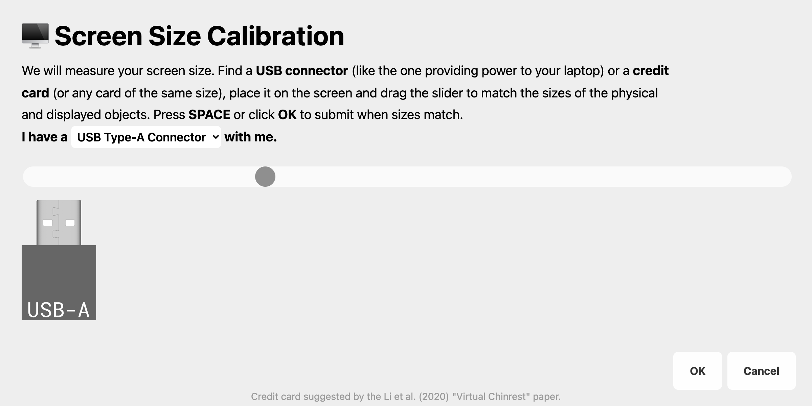
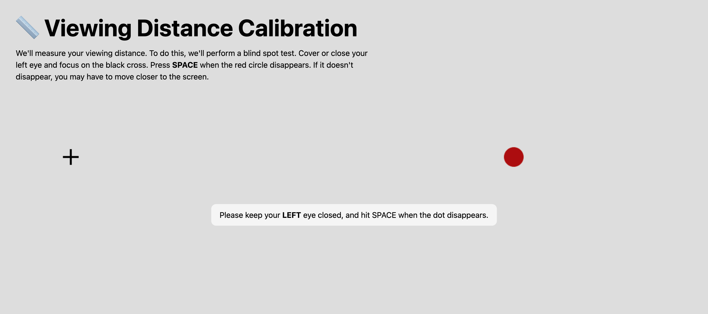
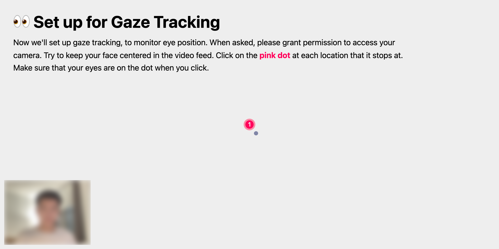

<p align="center">
  
</p>

# EasyEyes<br /> Remote Calibrator

[](https://npmjs.org/package/remote-calibrator)
[](https://github.com/EasyEyes/remote-calibrator/blob/main/LICENSE)
[](https://www.jsdelivr.com/package/npm/remote-calibrator)

Welcome to Remote Calibrator! This package contains several useful tools to calibrate and track for the remote psychophysics experiments, e.g., crowd-sourced through Amazon Mechanical Turk.

The features/functions marked with 🚧 are still work-in-progress and not available yet.

## Demo

Please visit https://calibrator.app for the demo. More information can be found at https://easyeyes.app/remote-calibrator/.

## Getting Started

To use Remote Calibrator, you can add the following line into the `<head>` of your HTML file.

```html
<script src="https://cdn.jsdelivr.net/npm/remote-calibrator@latest"></script>
```

Or use package management tools, e.g., [NPM](https://www.npmjs.com/package/remote-calibrator).

```shell
npm i remote-calibrator
```

And import the package to your project

```js
import RemoteCalibrator from 'remote-calibrator'
```

Either way, you will then be able to use functions listed below under `RemoteCalibrator`. For example,

```js
RemoteCalibrator.init({ id: 'session_022' })
RemoteCalibrator.measureDistance({}, data => {
  console.log(`The viewing distance is ${data.value}cm.`)
})
```

## Functions

| Task                                      | Functions                                                                                                                                                                                        |
| ----------------------------------------- | ------------------------------------------------------------------------------------------------------------------------------------------------------------------------------------------------ |
| [🎬 Initialize](#-initialize)             | [`init()`](#-initialize) (always required)                                                                                                                                                       |
| [🍱 Panel](#-panel)                       | [`panel()`](#-panel) `removePanel()` `resetPanel()`                                                                                                                                              |
| [🖥️ Screen](#️-screen)                    | [`displaySize()`](#measure-display-pixels) [`screenSize()`](#measure-screen-size)                                                                                                                |
| [📏 Viewing Distance](#-viewing-distance) | `measureDistance()`                                                                                                                                                                              |
| [🙂 Head Tracking](#-head-tracking)       | (viewing distance and [near point](#near-point)) [`trackDistance()`](#-head-tracking) [`async getDistanceNow()`](#async-get-distance-now) [Lifecycle](#lifecycle) [Others](#others)              |
| [👀 Gaze](#-gaze)                         | [`trackGaze()`](#start-tracking) [`async getGazeNow()`](#async-get-gaze-now) [`calibrateGaze()`](#calibrate) [`getGazeAccuracy()`](#get-accuracy-) [Lifecycle](#lifecycle-1) [Others](#others-1) |
| [💻 Environment](#-environment)           | [`environment()`](#-environment)                                                                                                                                                                 |
| [💄 Customization](#-customization)       | `backgroundColor()` `videoOpacity()` `showCancelButton()`                                                                                                                                        |
| [📔 Other Functions](#-other-functions)   | `checkInitialized()` `getFullscreen()`                                                                                                                                                           |
| [🎣 Getters](#-getters)                   | [Experiment](#experiment) [Environment](#environment) [All Data](#all-data) [Others](#others-2)                                                                                                  |

Arguments in square brackets are optional, e.g. `init([options, [callback]])` means both `options` configuration and the `callback` function are optional, but you have to put `options`, e.g., `{}`, if you want to call the callback function. The default values of `options` are listed in each section with explanation.

### 🎬 Initialize

```js
.init([options, [callback]])
```

Initialize RemoteCalibrator. Must be called before any other functions and can only run once. Return `this`.

Pass `{ value, timestamp }` (equivalent to `RemoteCalibrator.id`) to callback.

```js
/* [options] Default value */
{
  /**
   * The id of the session, a string
   * Will be attached to all the data from calibration
   * A random one will be generated if no value is passed into the function
   */
  id: /* Randomized value */,
  // Enter fullscreen if set to true
  // Will be ignored if already in fullscreen mode
  fullscreen: false,
}
```

The callback function will be called after the initialization. Like many other functions below, one argument **(an object)** will be passed into it then. Please see the example.

```js
function initializationFinished(data) {
  // data: { timestamp, value }
  console.log(`RemoteCalibrator was initialized at ${data.timestamp}.`)
}

let options = { id: 'session_022' }
RemoteCalibrator.init(options, initializationFinished)
```

If you do not want to change anything in default options, simply use an empty object like this:

```js
RemoteCalibrator.init({}, initializationFinished)
```

The `data` passed into the callback function is an [object](https://www.w3schools.com/js/js_objects.asp) with two fields: `timestamp` and `value` (the id). The `timestamp` is an JavaScript `Date()` object with all the information from the year to the millisecond. You can find how to get these information [here](https://www.w3schools.com/jsref/jsref_obj_date.asp).

### 🍱 Panel



```js
.panel(tasks, parentQuery, [options, [callback]])
```

`.panel()` is a powerful tool to help you set up a graphical user interface for participants to go through step-by-step and calibrate or set up tracking. It is highly customizable: tasks, task order, title, description, and "Done" button can all be customized. It is appended to the parent HTML node as set by `parentQuery`, e.g., if the parent node has id `main-area`, put `#main-area` as the `parentQuery`. Can only run once. Return the DOM element of the panel if set up successfully, otherwise `false`.

`tasks` is an array of tasks which can be a string or an object. Valid names are `screenSize`, `displaySize`, `measureDistance`, `trackDistance`, `trackGaze`, `environment` (system information).

<!-- prettier-ignore -->
```js
[
  'screenSize',
  {
    name: 'trackGaze',
    options: { framerate: 60 }, // Same as setting the options for .trackGaze()
    callback: gotGaze, // Same as setting the callback for .trackGaze()
  },
  // Tracking viewing distance accepts two callbacks just like .trackDistance()
  {
    name: 'trackDistance',
    callbackStatic: gotBlindSpotResult,
    callbackTrack: gotTrackResult,
    color: '#3490de',
  },
]
```

You can customize the panel element with the following options.

```js
/* [options] Default value */
{
  headline: `To calibrate, press a button!`,
  description: ``,
  nextButton: `Done`,
}
```

`callback` will be called when the next-step button is clicked, which is disabled until all the calibration steps are finished.

If you don't want to use the default panel and want to integrate the process into your experiment, you can also call each calibration function individually. Please see the instructions below.

You can also use `.removePanel()` to remove the panel element after the calibration is done, e.g., in the callback of `.panel()` function.

`.resetPanel([tasks, [parentQuery, [options, [callback]]]])` helps you reset the panel to its initial state, i.e. none of the buttons were pressed. You may also pass in new tasks, options, etc., to refresh the element. However, this will not end the current trackings.

### 🖥️ Screen

#### Measure Display Pixels

```js
.displaySize([callback])
```

Get the display width and height in pixels. This is just a wrapper of vanilla JavaScript's `window.innerWidth`, `window.screenWidth`, etc.

Pass `{ value: { displayWidthPx, displayHeightPx, windowWidthPx, windowHeightPx }, timestamp }` to callback.

#### Measure Screen Size



```js
.screenSize([options, [callback]])
```

Get the screen width and height in centimeters. Like many other calibration functions, this function will pop an overlay interface for participants to use. The callback function will be called after the calibration process (the participant presses SPACE in this case).

Pass `{ value: { screenWidthCm, screenHeightCm, screenDiagonalCm, screenDiagonalIn, screenPpi, screenPhysicalPpi }, timestamp }` to callback. `screenPpi` relates to the pixel data used in JavaScript, and `screenPhysicalPpi` is the [actual PPI](https://developer.mozilla.org/en-US/docs/Web/API/Window/devicePixelRatio) of some Retina displays.

```js
/* [options] Default value */
{
  // Enter fullscreen if set to true
  // Will be ignored if already in fullscreen mode
  fullscreen: false,
  // Quit fullscreen when calibration finished
  quitFullscreenOnFinished: false, 🚧
  // How many times the participant needs to calibrate
  repeatTesting: 1,
  // The length of decimal place of the returned value
  decimalPlace: 1,
  // Headline on the calibration page (Support HTML)
  headline: "🖥️ Screen Size Calibration",
  // Description and instruction (Support HTML)
  description: "...",
}
```

### 📏 Viewing Distance

**Before measuring or tracking viewing distance, calibration of the screen size is required to get the accurate value.**

#### Measure



```js
.measureDistance([options, [callback]])
```

Pop an interface for participants to calibrate the viewing distance at the moment using Blind Spot Test.

Pass `{ value, timestamp, method }` (equivalent to `RemoteCalibrator.viewingDistanceCm`) to callback.

```js
/* [options] Default value */
{
  fullscreen: false,
  quitFullscreenOnFinished: false, 🚧
  // How many times each of the eye will be used to test
  // By default, right eye 2 times, then left eye 2 times
  repeatTesting: 2,
  decimalPlace: 1,
  headline: "📏 Viewing Distance Calibration",
  description: "...",
}
```

### 🙂 Head Tracking

```js
.trackDistance([options, [callbackStatic, [callbackTrack]]])
```

Measure the viewing distance and then predict the real-time distance based on the change of the interpupillary distance, measured by [face landmarks](https://github.com/tensorflow/tfjs-models/tree/master/face-landmarks-detection). `callbackStatic` is called after getting the blind spot result and `callbackTrack` is called every time a new result from estimation is derived.

Pass `{ value: { viewingDistanceCm, nearPointCm: { x, y } }, timestamp, method }` to callback.

`method` can be either `"Blind Spot"` (for measures from blind spot tests) or `"Facemesh Predict"` (for later dynamic estimates).

```js
/* [options] Default value */
{
  fullscreen: false,
  repeatTesting: 2,
  pipWidthPx: 208,
  showVideo: true,
  showFaceOverlay: false,
  decimalPlace: 1,
  // Measurement per second
  framerate: 3,
  // Near point
  nearPoint: true,
  showNearPoint: false,
  headline: "👀 Calibrate Gaze",
  description: "...",
}
```

#### `async` Get Distance Now

```js
.getDistanceNow([callback])
```

You can pause active distance tracking, and use this function to get the latest distance at the moment when the user makes reactions. If no callback function is passed in, it will use the one from `.trackDistance()` as the default.

#### Near Point

The observer's near point is the orthogonal nearest viewing point in the screen, or the plane containing the screen. To track the near point, we assume that the webcam view is orthogonal to the display, and it is placed around 0.5cm above the top center of the screen (e.g., the built-in webcam of a MacBook). Our method is based on the Facemesh model and can give you an approximate estimation of the near point.

Setting `nearPoint` option to `true` (default) allows the system to track near point and pass the data into the `callbackTrack` function along with the distance data. The participant will also be instructed to measure and submit their interpupillary distance before the system can start predict the near point.

The value returned are the horizontal and vertical offsets, in centimeters, compared to **the center of the screen**. **Positive** values indicate that the near point is **above** and to the **right** of the center point.

#### Lifecycle

- `.pauseDistance()`
- `.resumeDistance()`
- `.endDistance([endAll = false])`

#### Others

- `.showNearPoint([Boolean])`

### 👀 Gaze

#### Start Tracking



```js
.trackGaze([options, [callback]])
```

Use [WebGazer](https://github.com/peilingjiang-DEV/WebGazer). Pop an interface for participants to calibrate their gaze position on the screen (only when this function is called for the first time), then run in the background and continuously predict the current gaze position. Require access to the camera of the participant's computer. The callback function will be executed repeatedly **every time** there's a new prediction.

This function should only be called once, unless you want to change the callback functions for every prediction.

Pass `{ value: { x, y }, timestamp }` (equivalent to `RemoteCalibrator.gazePositionPx`) to callback.

```js
/* [options] Default value */
{
  fullscreen: false,
  // Stop learning and improve the regression model after the calibration process
  greedyLearner: false,
  // Tracking (predicting) rate per second
  framerate: 30,
  // Draw the current gaze position on the screen (as a dot)
  showGazer: true,
  // Show the picture-in-picture video of the participant at the left bottom corner
  showVideo: true,
  // (Picture in picture) video width in pixels
  pipWidthPx: 208,
  // Show the face mesh
  showFaceOverlay: false,
  // How many times participant needs to click on each of the calibration dot
  calibrationCount: 5,
  // Min accuracy required in degree, set to 'none' to pass the accuracy check
  thresholdDeg: 10, 🚧
  decimalPlace: 1, // As the system itself has a high prediction error, it's not necessary to be too precise here
  headline: "👀 Calibrate Gaze",
  description: "...",
}
```

#### `async` Get Gaze Now

```js
.getGazeNow([callback])
```

You can pause active gaze tracking after calibration, and use this function to get the latest gaze position at the moment when the user makes reactions, i.e. calling this function in a [event listener](https://developer.mozilla.org/en-US/docs/Web/API/EventTarget/addEventListener). This can help reduce computing and get the gaze at the critical moment. If no callback function is passed in, it will use the one from `.trackGaze()` as the default.

Pass `{ value: { x, y }, timestamp }` (equivalent to `RemoteCalibrator.gazePositionPx`) to callback. Return the same thing.

#### Calibrate

```js
.calibrateGaze([options, [callback]])
```

Pop an interface for participants to calibrate their gaze position on the screen. Participants need to click on the dots around the screen for several times each. This function is automatically called in the `.trackGaze()` function when it's called for the first time, but you can always call this function directly as needed, e.g., when the gaze accuracy is low.

```js
/* [options] Default value */
{
  greedyLearner: false,
  // How many times participant needs to click on each of the calibration dot
  calibrationCount: 5,
  headline: "👀 Calibrate Gaze",
  description: "...",
}
```

#### Get Accuracy 🚧

```js
.getGazeAccuracy([callback])
```

#### Lifecycle

- `.pauseGaze()`
- `.resumeGaze()`
- `.endGaze([endAll = false])`

#### Others

- `.gazeLearning([Boolean])` WebGazer uses a regression model to always learn and update the model based on the assumption that one would always look at the point where curser makes interaction. However, in a psychophysics experiment, participants may not always look at the place where they click or move the cursor. Thus, `greedyLearner` option is set to `false` by default so that the tracker stops learning after calibration period. But you may also turn it on (or off if needed) again with this function.
- `.showGazer([Boolean])`
- `.showVideo([Boolean])`
- `.showFaceOverlay([Boolean])`

### 💻 Environment

```js
.environment([callback])
```

Get the setup information of the experiment, including browser type, device model, operating system family and version, etc. This function does not create its own timestamp, but use the one associated with `id`, i.e. the one created when `init()` is called.

Pass `{ value: { browser, browserVersion, model, manufacturer, engine, system, systemFamily, description, fullDescription }, timestamp }` to callback.

### 💄 Customization

- `.backgroundColor()` Set the color of the background. Default `#dddddd`.
- `.videoOpacity()` Set the opacity of the video element (in `trackDistance` and `trackGaze`). Default `0.8`.
- `.showCancelButton()` Show the **Cancel** button or not in the following calibrations. Default `true`.

### 📔 Other Functions

- `.checkInitialized()` Check if the model is initialized. Return a boolean.
- `.getFullscreen()` Get fullscreen mode.

### 🎣 Getters

Get the value directly.

Getters will get `null` if no data can be found, i.e. the corresponding function is never called. The values returned **by the getter** will be wrapped in an object with its corresponding timestamp. Thus, to get the value, add `.value`, e.g., `RemoteCalibrator.viewingDistanceCm.value` (and use `RemoteCalibrator.viewingDistanceCm.timestamp` to get the corresponding timestamp).

#### Experiment

- `.id` The id of the subject. The associated timestamp is the one created at initiation, i.e. when `init()` is called.
- `.displayWidthPx` `.displayHeightPx` `.windowWidthPx` `.windowHeightPx` The display (and window) width and height in pixels.
- `.screenWidthCm` `.screenHeightCm` `.screenDiagonalCm` `.screenDiagonalIn` `.screenPpi` `.screenPhysicalPpi` The physical screen size and monitor PPI in centimeters.
- `.viewingDistanceCm` The last measured viewing distance.
- `.nearPointCm` The last estimated near point.
- `.gazePositionPx` The last measured gaze position on the screen.
- `.isFullscreen` Whether the window is in fullscreen mode.

#### Environment

The associated timestamp of the following items is the one created at initiation, i.e. when `init()` is called.

- `.bot` If the user agent is a bot or not, an empty string will be returned if no bot detected, e.g., `Googlebot (Search bot) by Google Inc.`.
- `.browser` The browser type, e.g., `Safari`, `Chrome`.
- `.browserVersion` The browser version.
- `.deviceType` The type of device, e.g., `desktop`.
- `.model` The model type of the device, e.g., `iPad`.
- `.manufacturer` The device manufacturer.
- `.engine` The browser engine, e.g., `Webkit`.
- `.system` The device operating system, e.g., `OS X 11.2.1 64-bit`.
- `.systemFamily` The family name of the device OS, e.g., `OS X`.
- `.description` A tidy description of the current environment, e.g., `Chrome 89.0.4389.90 on OS X 11.2.1 64-bit`.
- `.fullDescription` The full description of the current environment.

#### All Data

Use the following keywords to retrieve the whole dataset.

- `.displayData`
- `.screenData`
- `.viewingDistanceData`
- `.nearPointData`
- `.PDData` (Interpupillary distance data)
- `.gazeData`
- `.fullScreenData`
- `.environmentData`

#### Others

- `.version` The RemoteCalibrator version. No associated timestamp.

## Development

[](https://app.netlify.com/sites/remote-calibrator/deploys)

For building the library locally or development, please follow the steps below.

### Setup

```shell
git clone --recurse-submodules https://github.com/EasyEyes/remote-calibrator.git
```

### Install

```shell
npm run setup
```

### Development Build

```shell
npm run dev
```

This command will give you a quick and continuous build of the package output into the `example/lib` folder. Then you may setup the local server (in another Terminal window) and develop based on it.

### Example

```shell
npm run serve
```

This will start a local server hosting the example page. You may then access the example at `localhost:8000`.

### Build

```shell
npm run build
```

This command will give you a minimized build of the package output into both of the `example/lib` and `lib` folders. You may use the file for production purposes.

## References

1. Li, Q., Joo, S. J., Yeatman, J. D., & Reinecke, K. (2020). Controlling for participants’ viewing distance in large-scale, psychophysical online experiments using a virtual chinrest. Scientific reports, 10(1), 1-11.
2. Papoutsaki, A., Sangkloy, P., Laskey, J., Daskalova, N., Huang, J., & Hays, J. (2016). Webgazer: Scalable webcam eye tracking using user interactions. In Proceedings of the Twenty-Fifth International Joint Conference on Artificial Intelligence-IJCAI 2016.

As we were wrapping up our development of Remote Calibrator, we realized that Thomas Pronk also made a demonstrative project showing integrating WebGazer into PsychoJS. We would love to acknowledge his work here as well.

3. Pronk, T. (2020). Demo of Eye-Tracking via Webcam in PsychoJS (Version 2) [Computer software]. Retrieved from https://gitlab.pavlovia.org/tpronk/demo_eye_tracking2/.
